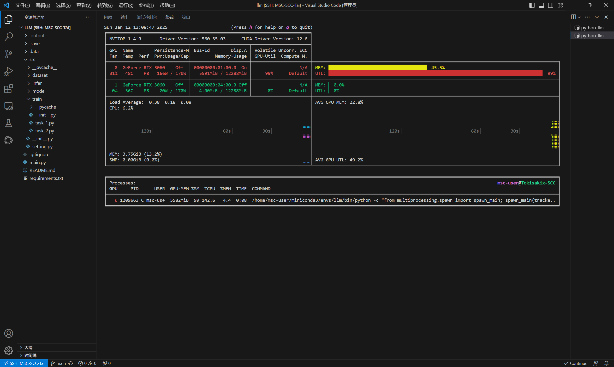
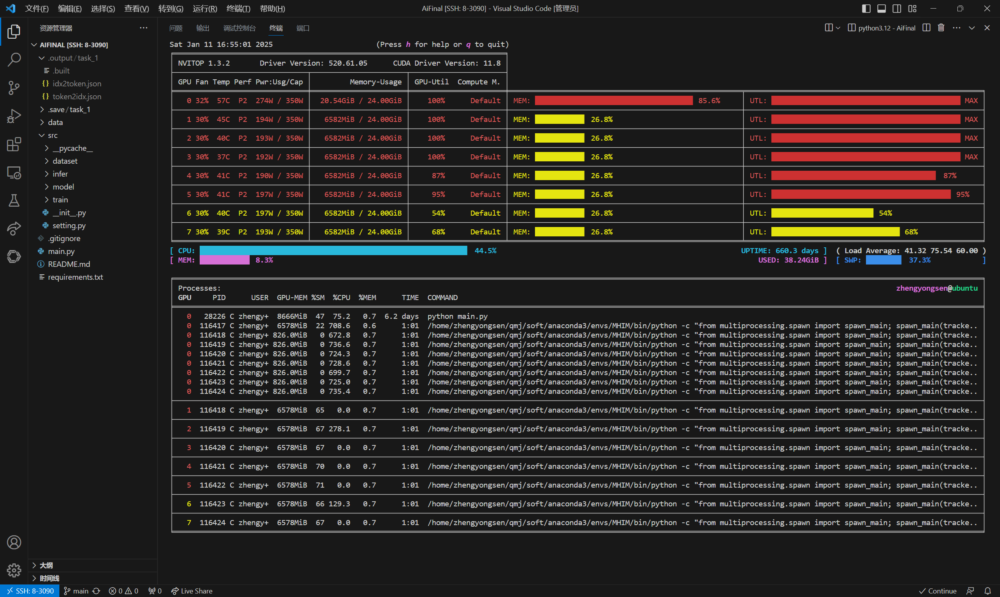
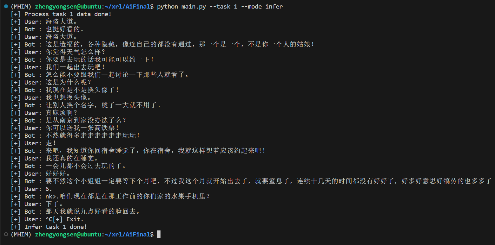
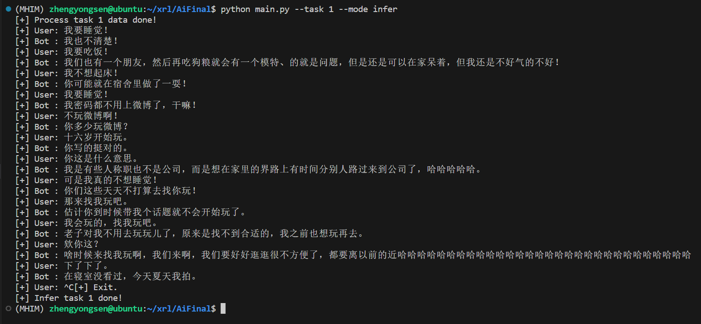
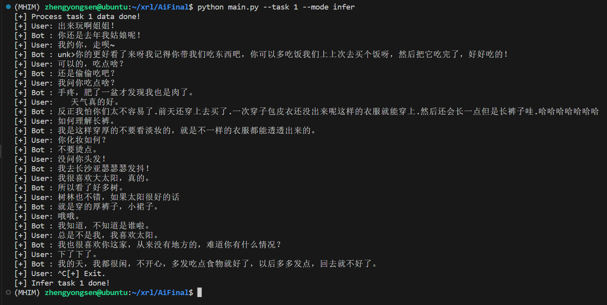
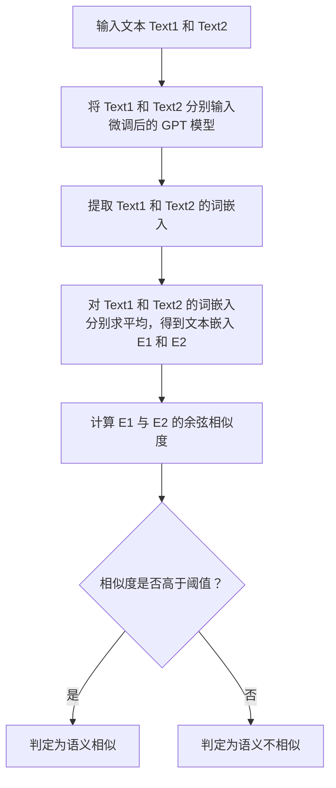

# 机器学习第二次大作业

## Task-1 基于 GPT 架构模型的对话生成 

### 数据预处理

> 数据预处理是模型训练前的关键步骤，主要包括数据清洗、分词、编码等操作。通过预处理，原始文本数据被转换为模型可接受的输入格式，确保数据的质量和一致性。具体步骤包括去除噪声数据、统一文本格式、分词处理、构建词汇表以及将文本转换为模型输入的数字序列。

此处的代码实现位于 `src/dataset/task_1.py`。

下方的代码实现了 Task-1 的数据读取、分词、编码等预处理，相关代码逻辑的解释已写在注释中。

```python
def process_task_1_data():
    # 检查是否已经处理过数据，如果已经处理过，则直接返回
    if os.path.isfile(os.path.join(TASK_1_OUTPUT_ROOT, ".built")):
        return

    # 确保输出目录存在，如果不存在则创建
    for output_path in [OUTPUT_ROOT, TASK_1_OUTPUT_ROOT]:
        if not os.path.exists(output_path):
            os.mkdir(output_path)

    # 读取原始数据文件
    data_file = os.path.join(TASK_1_DATA_ROOT, "train.txt")
    with open(data_file, "r", encoding="utf-8") as f:
        raw_data = f.read()

    # 将原始数据按行分割，并去除空行和前后空白字符
    sentences = [line.strip() for line in raw_data.split("\n") if line.strip()]

    # 构建词汇表，将所有句子中的字符去重后组成集合
    vocab = set("".join(sentences))

    # 初始化 token 到 index 的映射字典，包含特殊 token
    token2idx = {
        "<pad>": 0,  # 填充符
        "<unk>": 1,  # 未知字符
        "<sep>": 2,  # 分隔符
    }

    # 将词汇表中的每个字符映射到一个唯一的 index
    for token in vocab:
        token2idx[token] = len(token2idx)

    # 构建 index 到 token 的映射字典
    idx2token = {idx: token for token, idx in token2idx.items()}

    # 将 token2idx 字典保存为 JSON 文件
    json.dump(
        token2idx, 
        open(os.path.join(TASK_1_OUTPUT_ROOT, "token2idx.json"), "w", encoding="utf-8"), 
        ensure_ascii=False,  # 确保非 ASCII 字符正确保存
    )

    # 将 idx2token 字典保存为 JSON 文件
    json.dump(
        idx2token, 
        open(os.path.join(TASK_1_OUTPUT_ROOT, "idx2token.json"), "w", encoding="utf-8"), 
        ensure_ascii=False,  # 确保非 ASCII 字符正确保存
    )

    # 创建一个空文件 ".built" 作为标记，表示数据已经处理完成
    open(os.path.join(TASK_1_OUTPUT_ROOT, ".built"), "w", encoding="utf-8")

    return
```

下方的代码实现了专门用于 Task-1 的数据集类 `DatasetTaskV1`，相关代码逻辑的解释已写在注释中。

```python
class DatasetTaskV1(Dataset):
    def __init__(self, file_path, vocab_path, max_length=512):
        # 加载词汇表(字符到索引的映射)
        with open(vocab_path, "r", encoding="utf-8") as f:
            self.vocab = json.load(f)

        # 加载数据文件，按行分割并过滤掉空行和长度不符合要求的样本
        with open(file_path, "r", encoding="utf-8") as f:
            self.data = f.read().split("\n")
            # 过滤掉空行和长度超过 64 的样本
            self.data = [x for x in self.data if x.strip() and len(x.strip()) <= 64]
            # 过滤掉长度小于 16 的样本
            self.data = [x for x in self.data if len(x.strip()) >= 16]

        # 设置每个样本的最大长度
        self.max_length = max_length
        return

    def __len__(self):
        return len(self.data)

    def __getitem__(self, idx):
        # 获取索引对应的文本样本
        text = self.data[idx]

        # 将文本中的每个字符转换为对应的索引，如果字符不在词汇表中则使用 <unk> 的索引
        tokens = [self.vocab.get(char, self.vocab["<unk>"]) for char in text]

        # 如果序列长度超过最大长度，则截断
        if len(tokens) > self.max_length - 1:
            tokens = tokens[:self.max_length - 1]

        # 如果序列长度不足最大长度，则用 <pad> 填充
        tokens = tokens + [self.vocab["<pad>"]] * (self.max_length - len(tokens))

        # 将输入序列和目标序列转换为 PyTorch 张量
        # 输入序列 x 是 tokens 的前 max_length - 1 个元素
        x = torch.tensor(tokens[:-1])
        # 目标序列 y 是 tokens 的后 max_length - 1 个元素
        y = torch.tensor(tokens[1:])

        return x, y
```

### GPT 训练

> GPT 训练部分涉及模型的训练过程，包括从单机单卡到多机多卡的不同训练方式，以及混合精度训练和加速算子的使用。这些方法旨在提高训练效率和模型性能。

#### 单机单卡训练

> 单机单卡训练是最基础的训练方式，适用于小规模数据集或资源有限的情况。训练过程在一台机器的单个 GPU 上完成，通过反向传播算法更新模型参数，逐步优化模型性能。

此处的代码实现位于 `src/train/task_1.py`。

此部分我使用的训练环境配置如下：

- 操作系统: Ubuntu 22.04 LTS
- CPU: Intel(R) Xeon(R) Gold 6326 CPU @ 2.90GHz
- GPU: NVIDIA RTX3090 * 1
- CUDA 版本: 12.4
- Python 版本: 3.12
- PyTorch 版本: 2.4.1

对于 GPT 模型的单机训练，只需要正常初始化 `dataloader`、`model`、`criterion`、`optimizer` 即可，相关代码如下:

```python
dataset = DatasetTaskV1(
    os.path.join(TASK_1_DATA_ROOT, "train.txt"),
    os.path.join(TASK_1_OUTPUT_ROOT, "token2idx.json"),
)
dataloader = DataLoader(dataset, batch_size=TASK_1_BATCH_SIZE, shuffle=True)

token2idx = json.load(open(os.path.join(TASK_1_OUTPUT_ROOT, "token2idx.json"), "r", encoding="utf-8"))
device = torch.device(f"cuda:{rank}" if torch.cuda.is_available() else "cpu")

model = GPTModel(
    len(token2idx),
    D_MODEL,
    N_HEADS,
    N_LAYERS,
    D_FF,
    DROPOUT
).to(device)

optimizer = torch.optim.AdamW(model.parameters(), lr=TASK_1_LEARNING_RATE)
criterion = nn.CrossEntropyLoss(ignore_index=token2idx["<pad>"])
```

其中，`TASK_1_BATCH_SIZE` 和 `TASK_1_LEARNING_RATE` 是超参数，分别表示批量大小和学习率。`D_MODEL`、`N_HEADS`、`N_LAYERS`、`D_FF` 和 `DROPOUT` 是模型的结构参数，分别表示模型的维度、注意力头的数量、层的数量、前馈网络的维度和 dropout 的概率。`token2idx` 是词汇表到索引的映射，`device` 是模型所在的设备(CPU 或 GPU)。

下方代码实现了专门用于 Task-1 的训练函数 `train_model`，相关代码逻辑的解释已写在注释中。

```python
def train_model(model, train_loader, optimizer, criterion, device, num_epochs, save_dir):
    # 如果当前是主进程(rank == 0)，并且保存目录不存在，则创建目录
    if os.path.exists(save_dir):
        os.makedirs(save_dir)

    # 用于保存模型路径的列表
    save_model_path_list = []

    # 将模型设置为训练模式
    model.train()

    # 开始训练循环
    for epoch in range(1, num_epochs + 1):
        total_loss = 0  # 用于累计每个 epoch 的总损失

        # 遍历训练数据加载器
        for x, y in tqdm(train_loader):
            # 将数据移动到指定设备(如 GPU)
            x, y = x.to(device), y.to(device)

            # 清空优化器的梯度
            optimizer.zero_grad()

            # 前向传播：计算模型的输出
            output = model(x)

            # 计算损失：将输出和目标序列展平后计算损失
            loss = criterion(output.view(-1, output.size(-1)), y.view(-1))

            # 反向传播：计算梯度
            loss.backward()

            # 更新模型参数
            optimizer.step()

            # 累加当前 batch 的损失
            total_loss += loss.item()

        # 计算当前 epoch 的平均损失
        avg_loss = total_loss / len(train_loader)
        print(f"[+] Epoch {epoch} completed. Average loss: {avg_loss:.4f}")

        # 保存当前 epoch 的模型
        save_model_path = os.path.join(save_dir, f"model_{epoch}.pth")
        torch.save(model.state_dict(), save_model_path)
        save_model_path_list.append(save_model_path)
        print(f"[+] Save model into {save_model_path}")

        # 如果保存的模型数量超过限制，则删除最早的模型
        if len(save_model_path_list) > TASK_1_SAVE_MODEL_NUM:
            remove_model_path = save_model_path_list.pop(0)
            os.remove(remove_model_path)
            print(f"[+] Remove {remove_model_path}")

    return
```



#### 单机多卡训练

> 单机多卡训练利用一台机器上的多个 GPU 进行并行训练，适用于中等规模的数据集。通过数据并行或模型并行的方式，可以加速训练过程。数据并行将数据分片分配到不同 GPU 上计算梯度，而模型并行则将模型的不同部分分配到不同 GPU 上。

此处的代码实现位于 `src/train/task_1.py`。

此部分我使用的训练环境配置如下：

- 操作系统: Ubuntu 22.04 LTS
- CPU: Intel(R) Xeon(R) Gold 6326 CPU @ 2.90GHz
- GPU: NVIDIA RTX3090 * 8
- CUDA 版本: 12.4
- Python 版本: 3.12
- PyTorch 版本: 2.4.1

对于 GPT 模型的单机多卡训练，我们需要使用 `torch.distributed` 包来实现分布式训练，同时使用 `torch.nn.parallel.DistributedDataParallel` 来包装模型，其中 `dataloader` 和 `model` 的初始化也需要做出相应的修改，相关代码如下:

```python
dist.init_process_group(
    backend="nccl",
    init_method=f"tcp://{master_addr}:{master_port}",
    world_size=world_size,
    rank=rank,
)

<...>

sampler = DistributedSampler(dataset, num_replicas=world_size, rank=rank, shuffle=True)
train_loader = DataLoader(dataset, batch_size=TASK_1_BATCH_SIZE, sampler=sampler)

<...>

model = GPTModel(
    len(token2idx),
    D_MODEL,
    N_HEADS,
    N_LAYERS,
    D_FF,
    DROPOUT
).to(device)
model = DDP(model, device_ids=[rank])

<...>

dist.destroy_process_group()
```

我们使用 NCCL 作为分布式训练的后端，使用 `DistributedSampler` 来确保每个进程都能获取到不同的数据子集。我们使用 `DistributedDataParallel` (DDP) 来包装模型，以便在多个 GPU 上进行分布式训练。在训练完成后，我们调用 `dist.destroy_process_group()` 来销毁进程组，释放资源

值得一提的是 `sampler` 的使用，`DistributedSampler` 是 PyTorch 提供的一个采样器，用于在分布式训练中确保每个进程都能获取到不同的数据子集。`DistributedSampler` 会根据进程的 `rank` 和 `world_size` 来分配数据，确保每个进程都能获取到不同的数据子集，从而避免数据重复。

而对于单机多卡的训练，可以完全复用单机单卡的实现，此处便不再赘述。



#### 多机多卡训练

> 多机多卡训练涉及多台机器和多个 GPU 的协同工作，适用于大规模数据集和复杂模型。通过分布式训练框架(如 Horovod、PyTorch Distributed)，可以实现高效的资源利用和模型训练。训练过程中需要解决通信开销和负载均衡问题。

此处的代码实现位于 `src/train/task_1.py`。

此部分我使用的训练环境配置如下：

- 节点 1
    - 操作系统: Ubuntu 22.04 LTS
    - Ip：11.11.11.121/24
    - CPU: Intel(R) Xeon(R) Gold 6326 CPU @ 2.90GHz
    - GPU: NVIDIA A40 * 6
    - 网卡: NVIDIA CONNECTX-6 INFINIBAN
    - CUDA 版本: 12.4
    - Python 版本: 3.12
    - PyTorch 版本: 2.4.1
- 节点 2
    - 操作系统: Ubuntu 22.04 LTS
    - Ip：11.11.11.123/24
    - CPU: Intel(R) Xeon(R) Gold 6326 CPU @ 2.90GHz
    - GPU: NVIDIA A40 * 6
    - 网卡: NVIDIA CONNECTX-6 INFINIBAN
    - CUDA 版本: 12.4
    - Python 版本: 3.12
    - PyTorch 版本: 2.4.1

我们需要先在两个节点上搭建一个简易的集群环境，比如节点间的通信、文件共享等。

首先实现两个节点的网络通信，为两个节点分配 IP 分别为 `11.11.11.121/24` 和 `11.11.11.123/24`，它们都处在 `11.11.11.0/24` 子网下，确保两个节点之间可以互相 ping 通。

接着实现文件共享，此处使用 NFS 服务器，将 `11.11.11.121` 作为 NFS 服务器，`11.11.11.123` 作为 NFS 客户端，将服务器上的 `/home/` 目录挂载到客户端的 `/home/` 目录下，确保两个节点可以互相访问对方的文件。训练脚本和训练数据都可以放在共享目录下，方便两个节点同时访问。

```python
dist.init_process_group(
    backend="nccl",
    init_method=f"tcp://{master_addr}:{master_port}",
    world_size=world_size,
    rank=rank,
)
```

在 `dist.init_process_group()` 函数设置通信节点的 ip，端口，节点数量以及当前节点的编号。

而对于多机多卡的训练，可以完全复用单机单卡的实现，此处便不再赘述。


#### 混合精度训练

> 混合精度训练通过结合 FP16 和 FP32 两种精度进行计算，能够在保持模型精度的同时减少内存占用和计算开销，从而加速训练过程。NVIDIA 的 Apex 库和 PyTorch 的 AMP(Automatic Mixed Precision)是常用的混合精度训练工具。

此部分的代码实现位于 `src/train/task_1.py`。

为了支持混合精度训练，我们使用了 PyTorch 的 `torch.cuda.amp` 模块，具体实现如下:

1. 在训练函数 `train_model` 中，我们使用 `torch.cuda.amp.autocast()` 上下文管理器来自动进行混合精度计算。在这个上下文中，PyTorch 会自动将部分计算转换为 FP16 以加速训练。

2. 我们使用 `GradScaler` 来管理损失缩放。在反向传播时，`scaler.scale(loss).backward()` 会自动缩放损失值，以防止梯度下溢。然后使用 `scaler.step(optimizer)` 来更新模型参数，最后调用 `scaler.update()` 来调整缩放因子。

3. 在 `run_train_task_1` 函数中，我们初始化了数据集、采样器、数据加载器、模型、优化器、损失函数和 `GradScaler`。然后调用 `train_model` 函数开始训练。

```python
def train_model(rank, model, train_loader, optimizer, criterion, scaler, device, num_epochs, save_dir):
    # 开始训练循环
    for epoch in range(1, num_epochs + 1):
        total_loss = 0  # 用于累计每个 epoch 的总损失

        # 遍历训练数据加载器
        for x, y in tqdm(train_loader):
            # 将数据移动到指定设备(如 GPU)
            x, y = x.to(device), y.to(device)

            # 清空优化器的梯度
            optimizer.zero_grad()

            # 使用混合精度训练(autocast)计算前向传播
            with autocast():
                # 前向传播：计算模型的输出
                output = model(x)
                # 计算损失：将输出和目标序列展平后计算损失
                loss = criterion(output.view(-1, output.size(-1)), y.view(-1))

            # 使用梯度缩放器进行反向传播和参数更新
            scaler.scale(loss).backward()  # 缩放损失并反向传播
            scaler.step(optimizer)         # 更新模型参数
            scaler.update()                # 更新梯度缩放器的缩放因子

            total_loss += loss.item()

        if rank == 0:
            <...>

    return

def run_train_task_1(rank, world_size, nodes, node_rank, master_addr, master_port):
    <...>

    dataset = <...>
    sampler = <...>
    train_loader = <...>
    token2idx = <...>
    device = <...>
    model = <...>
    model = <...>

    optimizer = <...>
    criterion = <...>
    # 初始化梯度缩放器(用于混合精度训练)
    scaler = GradScaler()

    <...>

    train_model(rank, model, train_loader, optimizer, criterion, scaler, device, TASK_1_NUM_EPOCHS, TASK_1_SAVE_ROOT)

    <...>
    return
```

### GPT 推理

> GPT 推理部分涉及模型在实际应用中的推理过程，包括推理流程的设计、采样器的使用、量化推理和 KV 缓存的优化。这些技术旨在提高推理速度和效率。

#### 推理流程

> 推理流程是指模型从输入到输出的完整计算过程。通常包括输入编码、模型前向计算、输出解码等步骤。输入文本首先被转换为模型可接受的数字序列，经过模型的多层 Transformer 计算后，生成输出序列，最后通过解码器转换为自然语言文本。

此部分的代码实现位于 `src/infer/inference.py`。

为了简要的实现基本的推理功能，我们首先使用贪婪采样策略，即每次选择概率最高的词作为下一个词。这种策略简单直接，但生成的文本可能会缺乏多样性。

```python
def generate(model, token2idx, idx2token, input_text, sampler, device, max_length=64):
    # 将模型设置为评估模式
    model.eval()

    # 将输入文本转换为 token ID 列表
    tokens = [token2idx.get(char, token2idx["<unk>"]) for char in input_text]

    # 将 token ID 列表转换为 PyTorch 张量并移动到指定设备
    input_ids = torch.tensor([tokens], dtype=torch.long).to(device)

    # 定义停止 token，用于结束生成过程
    stop_token = [token2idx[token] for token in ["<sep>", "。", "？", "！"]]

    # 禁用梯度计算
    with torch.no_grad():
        # 开始生成文本，最多生成 max_length 个 token
        for _ in range(max_length):
            # 获取模型的输出
            outputs = model(input_ids)
            # 提取最后一个 token 的 logits
            next_token_logits = outputs[0, -1, :]
            # 将 logits 转换为概率分布
            probs = F.softmax(next_token_logits, dim=-1)
            # 使用采样器选择下一个 token
            next_token_id = sampler.apply(probs)
            # 将新生成的 token 添加到 token 列表中
            tokens.append(next_token_id)
            # 更新输入张量
            input_ids = torch.tensor([tokens], dtype=torch.long).to(device)
            # 如果生成的 token 是停止 token，则结束生成
            if next_token_id in stop_token:
                break

    # 将生成的 token ID 列表转换为文本
    generated_tokens = input_ids[0].tolist()
    generated_text = "".join([idx2token.get(token_id, "") for token_id in generated_tokens])
    # 提取生成的回复部分(去掉用户输入部分)
    reply = generated_text[len(input_text):]
    return reply

def infer():
    # 加载词汇表
    token2idx, idx2token = load_vocab(os.path.join(TASK_1_OUTPUT_ROOT, "token2idx.json"))

    # 设置运行设备
    device = torch.device("cuda:7" if torch.cuda.is_available() else "cpu")

    # 初始化推理模型并加载训练好的权重
    model = GPTInferModel(len(token2idx)).to(device)
    model.load_state_dict(torch.load(TASK_1_MODEL_PATH, map_location=device, weights_only=True))

    # 初始化采样器
    sampler = Sampler(INFER_TEMPERATURE, INFER_TOP_K, INFER_TOP_P)

    try:
        # 进入交互循环
        while True:
            # 获取用户输入
            user_input = input("[+] User: ")
            # 生成回复
            reply = generate(model, token2idx, idx2token, user_input, sampler, device)
            # 打印生成的回复
            print(f"[+] Bot : {reply}")
    except KeyboardInterrupt:
        # 捕获 Ctrl+C 退出信号
        print("[+] Exit.")
    return
```

#### 采样器

> 采样器用于在生成文本时从模型的输出分布中选择下一个词。常见的采样方法包括贪婪搜索、束搜索、Top-k采样和Top-p采样等。贪婪搜索选择概率最高的词，束搜索保留多个候选序列，Top-k 采样从概率最高的k个词中随机选择，Top-p 采样从累积概率超过 p 的词中随机选择。

上面我们已经实现了文本生成的基本流程，但是采用了贪婪的采样逻辑，这会导致生成的文本缺乏多样性。为了提高生成文本的多样性，我们可以采用以下几种采样策略：

- 温度采样：通过调整温度参数来控制生成文本的多样性。温度越高，生成的文本越随机；温度越低，生成的文本越倾向于选择概率最高的词。
- Top-K 采样：在每一步生成时，只从概率最高的 K 个词中进行采样，这样可以避免生成低概率的词，提高生成文本的质量。
- Top-P 采样：在每一步生成时，从累积概率超过 P 的最小词集中进行采样，这样可以动态调整采样范围，平衡生成文本的多样性和质量。

下面是这三种采样算法的实现，相关代码位于 `src/infer/sampler.py`。

```python
class Sampler:
    def __init__(self, temperature: float = 1.0, top_k: int = None, top_p: float = None):
        self.temperature = temperature
        self.top_k = top_k
        self.top_p = top_p
        return

    def _apply_temperature(self, probs: torch.FloatTensor) -> torch.FloatTensor:
        if self.temperature != 1.0:
            # 通过温度参数调整 logits 并重新计算 softmax
            probs = torch.softmax(torch.log(probs) / self.temperature, dim=-1)
        return probs

    def _apply_top_k(self, probs: torch.FloatTensor) -> torch.FloatTensor:
        if self.top_k is not None:
            # 获取前 k 个概率最高的 token 及其概率
            values, indices = torch.topk(probs, self.top_k)
            # 将其他 token 的概率置为 0
            probs = torch.zeros_like(probs).scatter_(-1, indices, values)
            # 重新计算 softmax
            probs = torch.softmax(probs, dim=-1)
        return probs

    def _apply_top_p(self, probs: torch.FloatTensor) -> torch.FloatTensor:
        if self.top_p is not None:
            # 对概率进行降序排序
            sorted_probs, sorted_indices = torch.sort(probs, descending=True)
            # 计算累积概率
            cumulative_probs = torch.cumsum(sorted_probs, dim=-1)
            # 找到累积概率超过 top_p 的 token
            sorted_indices_to_remove = cumulative_probs > self.top_p
            # 保留第一个超过 top_p 的 token
            sorted_indices_to_remove[..., 1:] = sorted_indices_to_remove[..., :-1].clone()
            sorted_indices_to_remove[..., 0] = 0
            # 获取需要移除的 token 索引
            indices_to_remove = sorted_indices[sorted_indices_to_remove]
            # 将这些 token 的概率置为 0
            probs = probs.scatter(-1, indices_to_remove, 0.0)
            # 重新计算 softmax
            probs = torch.softmax(probs, dim=-1)
        return probs

    def apply(self, probs: torch.FloatTensor) -> int:
        # 依次应用温度、top-k 和 top-p 采样
        probs = self._apply_temperature(probs)
        probs = self._apply_top_k(probs)
        probs = self._apply_top_p(probs)
        # 从调整后的概率分布中进行多项式采样
        return torch.multinomial(probs, num_samples=1).item()
```

#### 量化推理

> 量化推理通过将模型参数从浮点数转换为低精度整数(如 INT8)，以减少内存占用和计算量，从而加速推理过程。量化技术可以在几乎不损失模型精度的情况下显著提升推理速度，适用于资源受限的场景。

此处的代码位于 `src/infer/inference.py`。

如果运行设备位于 CPU，则使用 `torch.quantization.quantize_dynamic` 对模型进行动态量化，将模型中的线性层(`torch.nn.Linear`)量化为 `torch.qint8` 类型。

如果运行设备位于 GPU，则将模型转换为半精度浮点数(`half()`)，并使用 `torch.compile` 对模型进行编译优化。

```python
def infer():
    # 加载词汇表(字符到索引和索引到字符的映射)
    token2idx, idx2token = load_vocab(os.path.join(TASK_1_OUTPUT_ROOT, "token2idx.json"))

    # 设置推理设备(从配置中读取)
    device = INFER_DEVICE

    # 初始化推理模型
    model = GPTInferModel(len(token2idx)).to(device)

    # 加载训练好的模型权重
    model.load_state_dict(torch.load(TASK_1_MODEL_PATH, map_location=device, weights_only=True))

    # 如果设备是 CPU，则对模型进行动态量化以加速推理
    if device == "cpu":
        model = quantize_dynamic(
            model,
            {torch.nn.Linear},  # 对线性层进行量化
            dtype=torch.qint8   # 使用 8 位整数量化
        )
        model.to(device)
    # 如果设备是 GPU，则将模型转换为半精度(float16)并使用 torch.compile 加速
    elif "cuda" in device:
        model = model.half()  # 将模型参数转换为半精度
        model = torch.compile(model)  # 使用 torch.compile 优化模型

    # 初始化采样器，用于从模型输出中选择下一个 token
    sampler = Sampler(INFER_TEMPERATURE, INFER_TOP_K, INFER_TOP_P)

    try:
        # 进入交互式对话循环
        while True:
            # 获取用户输入
            user_input = input("[+] User: ")
            # 使用模型生成回复
            reply = generate(model, token2idx, idx2token, user_input, sampler, device)
            # 打印生成的回复
            print(f"[+] Bot : {reply}")
    except KeyboardInterrupt:
        # 捕获 Ctrl+C 退出信号
        print("[+] Exit.")
    return
```

## Task-2 情感分类

### 数据预处理

> 情感分类任务的数据预处理包括文本清洗、分词、标签编码等操作。通过预处理，文本数据被转换为适合情感分类模型输入的格式。具体步骤包括去除标点符号、停用词过滤、词干提取、构建词汇表以及将文本转换为数字序列。标签编码将情感类别(如正面、负面、中性)转换为模型可处理的数字标签。

此处的代码实现位于 `src/dataset/task_2.py`。

下方的代码实现了 Task-2 的数据读取、分词、编码等预处理，相关代码逻辑的解释已写在注释中。

```python
def process_task_2_data():
    # 检查是否已经处理过数据，如果已经处理过，则直接返回
    if os.path.isfile(os.path.join(TASK_2_OUTPUT_ROOT, ".built")):
        return

    # 确保输出目录存在，如果不存在则创建
    for output_path in [OUTPUT_ROOT, TASK_2_OUTPUT_ROOT]:
        if not os.path.exists(output_path):
            os.mkdir(output_path)

    # 加载任务1的词汇表（字符到索引的映射）
    with open(os.path.join(TASK_1_OUTPUT_ROOT, "token2idx.json"), "r", encoding="utf-8") as f:
        token2idx = json.load(f)

    # 加载任务2的原始数据
    data = pd.read_csv(os.path.join(TASK_2_DATA_ROOT, "ChnSentiCorp_htl_all.csv"))
    # 删除包含空值的行
    data = data.dropna(subset=["review", "label"]).reset_index(drop=True)
    # 打乱数据顺序
    data = shuffle(data, random_state=SEED).reset_index(drop=True)

    # 按标签将数据分为两类
    data_0 = data[data["label"] == 0].reset_index(drop=True)  # 标签为 0 的数据
    data_1 = data[data["label"] == 1].reset_index(drop=True)  # 标签为 1 的数据

    # 平衡两类数据，取样本数较少的一类作为基准
    n_samples = min(len(data_0), len(data_1))
    balanced_data_0 = data_0.head(n_samples)  # 标签为 0 的平衡数据
    balanced_data_1 = data_1.head(n_samples)  # 标签为 1 的平衡数据
    balanced_data = pd.concat([balanced_data_0, balanced_data_1], ignore_index=True)  # 合并平衡后的数据

    # 从平衡数据中随机抽取测试集
    test_data_0 = balanced_data_0.sample(n=250, random_state=SEED)  # 标签为 0 的测试数据
    test_data_1 = balanced_data_1.sample(n=250, random_state=SEED)  # 标签为 1 的测试数据
    test_data = pd.concat([test_data_0, test_data_1], ignore_index=True)  # 合并测试数据

    # 从平衡数据中移除测试集，得到训练集
    train_data_0 = balanced_data_0.drop(test_data_0.index).reset_index(drop=True)  # 标签为 0 的训练数据
    train_data_1 = balanced_data_1.drop(test_data_1.index).reset_index(drop=True)  # 标签为 1 的训练数据
    train_data = pd.concat([train_data_0, train_data_1], ignore_index=True)  # 合并训练数据

    # 保存训练集和测试集到 CSV 文件
    train_data.to_csv(os.path.join(TASK_2_OUTPUT_ROOT, "emotion_train.csv"), index=False)
    test_data.to_csv(os.path.join(TASK_2_OUTPUT_ROOT, "emotion_test.csv"), index=False)

    # 构建词汇表
    all_text = "".join(map(str, train_data["review"]))  # 将所有训练文本拼接成一个字符串
    vocab = set(all_text)  # 去重得到字符集合

    # 将新字符添加到词汇表中
    for token in vocab:
        if token not in token2idx:
            token2idx[token] = len(token2idx)

    # 构建索引到字符的映射
    idx2token = {idx: token for token, idx in token2idx.items()}

    # 保存词汇表到 JSON 文件
    json.dump(
        token2idx, 
        open(os.path.join(TASK_2_OUTPUT_ROOT, "token2idx.json"), "w", encoding="utf-8"), 
        ensure_ascii=False,  # 确保非 ASCII 字符正确保存
    )
    json.dump(
        idx2token, 
        open(os.path.join(TASK_2_OUTPUT_ROOT, "idx2token.json"), "w", encoding="utf-8"), 
        ensure_ascii=False,  # 确保非 ASCII 字符正确保存
    )

    # 创建一个空文件 ".built" 作为标记，表示数据已经处理完成
    open(os.path.join(TASK_2_OUTPUT_ROOT, ".built"), "w", encoding="utf-8")
    return
```

下方的代码实现了专门用于 Task-2 的数据集类 `DatasetTaskV2`，相关代码逻辑的解释已写在注释中。

```python
class DatasetTaskV2(Dataset):
    def __init__(self, csv_file, vocab_path, max_length=512):
        # 加载词汇表（字符到索引的映射）
        with open(vocab_path, "r", encoding="utf-8") as f:
            self.vocab = json.load(f)

        # 加载 CSV 文件中的数据
        self.data = pd.read_csv(csv_file, dtype={"review": str, "label": int})
        # 将 "review" 列中的空值填充为空字符串
        self.data["review"] = self.data["review"].fillna("")

        # 设置每个样本的最大长度
        self.max_length = max_length
        return

    def __len__(self):
        return len(self.data)

    def __getitem__(self, idx):
        # 获取索引对应的文本和标签
        text = self.data.loc[idx, "review"]
        label = self.data.loc[idx, "label"]

        # 确保文本是字符串类型
        if not isinstance(text, str):
            text = str(text)

        # 将文本中的每个字符转换为对应的索引，如果字符不在词汇表中则使用 <unk> 的索引
        tokens = [self.vocab.get(char, self.vocab["<unk>"]) for char in text]

        # 如果序列长度超过最大长度，则截断
        if len(tokens) > self.max_length:
            tokens = tokens[:self.max_length]
        # 如果序列长度不足最大长度，则用 <pad> 填充
        else:
            tokens += [self.vocab["<pad>"]] * (self.max_length - len(tokens))

        # 将 token 列表转换为 PyTorch 张量
        input_ids = torch.tensor(tokens)
        # 将标签转换为 PyTorch 张量
        label = torch.tensor(label, dtype=torch.float)

        return input_ids, label
```

### 模型微调

> 模型微调是指在预训练模型的基础上，针对特定任务(如情感分类)进行进一步的训练。通过微调，模型能够更好地适应特定任务的数据分布。微调过程通常包括加载预训练模型、冻结部分层、调整学习率以及在目标数据集上进行训练。微调后的模型能够更准确地捕捉情感特征。

此部分的代码位于 `src/train/task_2.py`

我们利用 Task-1 训练好的模型，将模型的最后一层去掉，得到 768 维的特征向量，作为 Task-2 的输入特征，然后训练一个全连接层进行分类。

此处我们给出两种参数冻结的方式，分别是冻结所有参数和冻结部分参数。

```python
def freeze_parameters(model, freeze_type="all"):
    if freeze_type == "all":
        # 冻结所有参数（禁用梯度计算）
        for param in model.parameters():
            param.requires_grad = False
    elif freeze_type == "last":
        # 默认冻结所有参数
        for param in model.parameters():
            param.requires_grad = False
        # 解冻最后一层的参数
        for name, param in model.named_parameters():
            if "layers.5" in name:  # 假设模型的最后一层名为 "layers.5"
                param.requires_grad = True
        # 解冻分类器层的参数
        for param in model.classifier.parameters():
            param.requires_grad = True
    return
```

Task-2 在训练时，实际上跟一般的文本分类没有什么区别，都是全监督学习的流水线，只不过在训练时，我们冻结了部分参数，只训练最后一层和分类器层 —— 而这实际上就是迁移学习的思想。

下面给出 Task-2 的训练代码，与 Task-1 一样，Task-2 支持分布式训练、混合精度训练等功能。

```python
def run_train_task_2(rank, world_size, nodes, node_rank, master_addr, master_port):
    # 初始化分布式训练环境
    dist.init_process_group(
        backend="nccl",  # 使用 NCCL 后端（适用于 GPU）
        init_method=f"tcp://{master_addr}:{master_port}",  # 初始化方法
        world_size=world_size,  # 总进程数
        rank=rank,  # 当前进程的排名
    )

    # 加载训练数据集
    train_dataset = DatasetTaskV2(
        os.path.join(TASK_2_OUTPUT_ROOT, "emotion_train.csv"),  # 训练数据路径
        os.path.join(TASK_2_OUTPUT_ROOT, "token2idx.json"),  # 词汇表路径
    )
    # 加载测试数据集
    test_dataset = DatasetTaskV2(
        os.path.join(TASK_2_OUTPUT_ROOT, "emotion_test.csv"),  # 测试数据路径
        os.path.join(TASK_2_OUTPUT_ROOT, "token2idx.json"),  # 词汇表路径
    )

    # 创建分布式采样器
    train_sampler = DistributedSampler(train_dataset, num_replicas=world_size, rank=rank, shuffle=True)
    test_sampler = DistributedSampler(test_dataset, num_replicas=world_size, rank=rank, shuffle=False)

    # 创建数据加载器
    train_loader = DataLoader(train_dataset, batch_size=TASK_2_BATCH_SIZE, sampler=train_sampler)
    test_loader = DataLoader(test_dataset, batch_size=TASK_2_BATCH_SIZE, sampler=test_sampler)

    # 加载词汇表
    token2idx = json.load(open(os.path.join(TASK_2_OUTPUT_ROOT, "token2idx.json"), "r", encoding="utf-8"))

    # 设置训练设备
    device = torch.device(f"cuda:{rank}" if torch.cuda.is_available() else "cpu")

    # 初始化模型
    model = GPTModel(
        len(token2idx),  # 词汇表大小
        D_MODEL,  # 模型维度
        N_HEADS,  # 多头注意力头数
        N_LAYERS,  # 层数
        D_FF,  # 前馈网络维度
        DROPOUT  # Dropout 概率
    ).to(device)

    # 将模型包装为分布式数据并行模型
    model = DDP(model, device_ids=[rank])

    # 加载预训练模型权重
    model = load_pretrained_model(model, TASK_1_MODEL_PATH, device)

    # 替换模型的分类器层
    model.classifier = nn.Sequential(
        nn.Dropout(0.5),  # Dropout 层
        nn.Linear(model.module.out.out_features, 1)  # 线性层，输出维度为 1（二分类任务）
    ).to(device)

    # 根据配置冻结模型参数
    freeze_parameters(model, freeze_type=TASK_2_FREEZE_TYPE)

    # 初始化优化器，仅优化需要梯度的参数
    optimizer = torch.optim.AdamW(
        filter(lambda p: p.requires_grad, model.parameters()),  # 过滤需要梯度的参数
        lr=TASK_2_LEARNING_RATE,  # 学习率
        weight_decay=1e-2  # 权重衰减
    )

    # 定义损失函数（二分类交叉熵损失）
    criterion = nn.BCEWithLogitsLoss()

    # 开始训练
    train_model(rank, model, train_loader, test_loader, optimizer, criterion, device, TASK_2_NUM_EPOCHS, TASK_2_SAVE_ROOT)

    # 销毁进程组
    dist.destroy_process_group()
    return


def train_task_2(nproc, nodes, node_rank, master_addr, master_port):
    # 计算总进程数
    world_size = nproc * nodes

    # 使用多进程启动训练
    mp.spawn(
        run_train_task_2,  # 训练函数
        args=(world_size, nodes, node_rank, master_addr, master_port),  # 传递给训练函数的参数
        nprocs=nproc,  # 每个节点的进程数
        join=True  # 等待所有进程完成
    )
    return
```


## 总结

### i. 数据预处理的方法

详细过程已在前文提及，简要总结如下：

1. 数据清洗：去除特殊字符
2. 分词：使用字符分词或 jieba 进行中文分词
3. 编码：将文本映射为整数序列
4. 填充和截断：统一序列长度，便于模型处理
5. 数据加载器：将数据转换为便于批量训练的格式

### ii.所实现的 GPT 模型的结构，以及参数

此处超参数可以在 `src/setting.py` 直接设置，本次实验使用的超参数如下

```python
# Path setting
DATA_ROOT   = "data/"
OUTPUT_ROOT = ".output/"
SAVE_ROOT   = ".save/"

SEED = 22331109

# Task 1 setting
TASK_1_DATA_ROOT   = os.path.join(DATA_ROOT, "task_1")
TASK_1_OUTPUT_ROOT = os.path.join(OUTPUT_ROOT, "task_1")
TASK_1_SAVE_ROOT   = os.path.join(SAVE_ROOT, "task_1")
TASK_1_MODEL_PATH  = os.path.join(SAVE_ROOT, "task_1.pth")

TASK_1_BATCH_SIZE     = 32
TASK_1_LEARNING_RATE  = 1e-4
TASK_1_NUM_EPOCHS     = 50
TASK_1_SAVE_MODEL_NUM = 5

# Task 2 setting
TASK_2_DATA_ROOT   = os.path.join(DATA_ROOT, "task_2")
TASK_2_OUTPUT_ROOT = os.path.join(OUTPUT_ROOT, "task_2")
TASK_2_SAVE_ROOT   = os.path.join(SAVE_ROOT, "task_2")
TASK_2_MODEL_PATH  = os.path.join(SAVE_ROOT, "task_2.pth")

TASK_2_BATCH_SIZE     = 32
TASK_2_LEARNING_RATE  = 1e-5
TASK_2_NUM_EPOCHS     = 20
TASK_2_FREEZE_TYPE    = "all" # "all" or "last"
TASK_2_SAVE_MODEL_NUM = 5

# Model setting
D_MODEL  = 256
N_HEADS  = 8
N_LAYERS = 6
D_FF     = 1024
DROPOUT  = 0.1

# Inference setting
INFER_TEMPERATURE = 0.2
INFER_TOP_K = 40
INFER_TOP_P = 0.9
INFER_DEVICE = "cuda:7"
```

### iii.模型测试效果截图(最少 3 次交互对话，每次至少 10 句话)

1. Greedy Sample



2. Temperature Sample，temp=0.8



3. Top-K Sample，k=4



4. Top-P Sample，p=0.95


### iv.情感分类的准确率

1. 训练所有层，模型在测试集上达到了 97.10% 的准确率，说明训练所有层会有更好的性能，但是对应的训练成本也会更高。

2. 训练输出层，模型准确率为 91.30%，说明只训练输出层会相比训练所有层而言导致模型性能下降。

3. 禁用 Mask 会导致模型准确率下降，Mask 实际上起到一个过滤作用，防止模型关注到填充部分的信息，禁用 Mask 后模型会关注到填充部分的信息，导致模型准确率下降

### vi.如何实现判断文本语义相似度

可以使用文本嵌入模型得到文本向量，通过余弦相似度进行判断

$
\text{相似度} = \cos(\theta) = \frac{\mathbf{A} \cdot \mathbf{B}}{\|\mathbf{A}\| \|\mathbf{B}\|}
$

其中，$\mathbf{A}$ 和 $\mathbf{B}$ 是两个文本的嵌入向量

